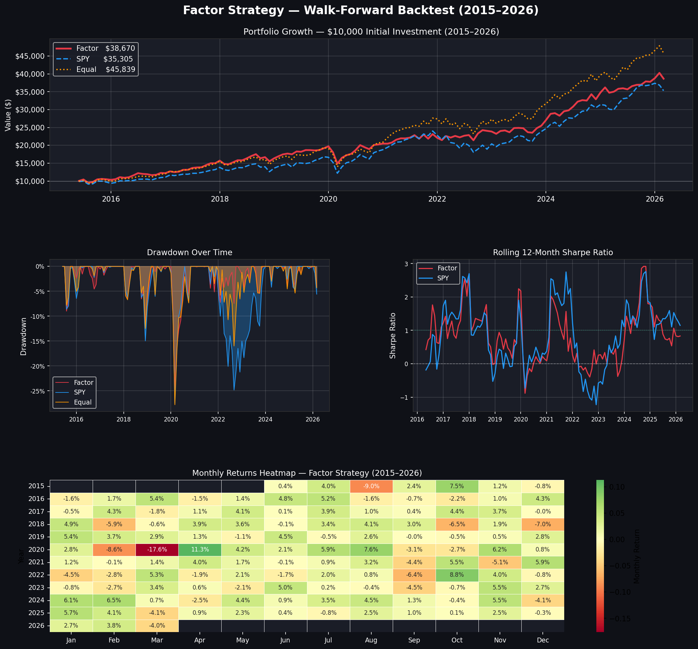
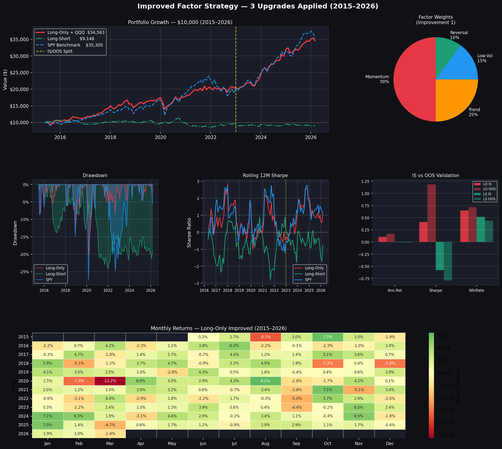
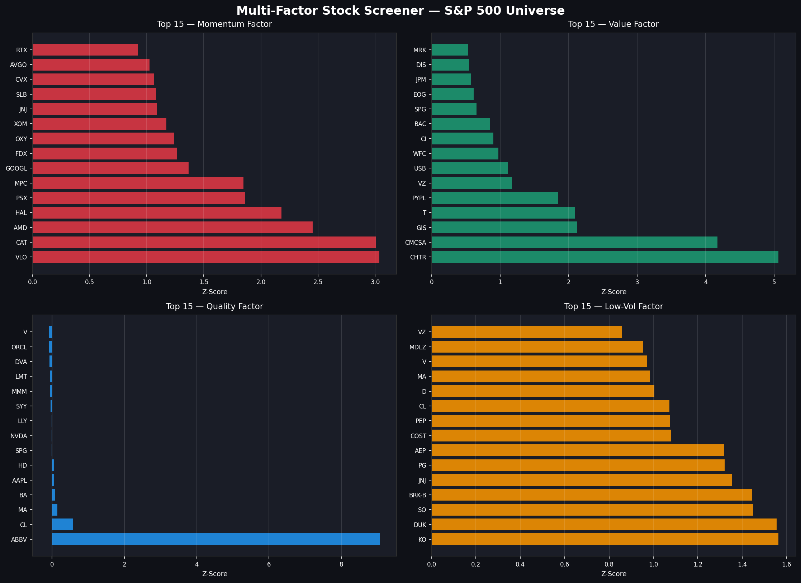

# Multi-Factor Systematic Trading System

A production-grade quantitative trading system that implements a 
4-factor stock screener, walk-forward backtesting engine, market 
regime detection, and live automated paper trading via Alpaca API.

---

## System Architecture

factor_engine.py          # Factor scorer — ranks S&P 500 stocks
backtest_engine.py        # Walk-forward backtesting engine
production_strategy.py    # Production strategy (5 institutional gaps closed)
improved_strategy.py      # Improved strategy (3 upgrades applied)
live_trader.py            # Live Alpaca paper trading system
scheduler.py              # Windows Task Scheduler automation
cloud_scheduler.py        # Cloud deployment scheduler
email_reporter.py         # Automated email reporting

---

## The 4 Factors

| Factor | Weight | What it measures |
|:---|:---:|:---|
| **Momentum** | 50% | 12-month return skip 1 month |
| **Trend** | 25% | Position within 52-week range |
| **Low Volatility** | 15% | Inverse annualized volatility |
| **Reversal** | 10% | Short-term mean reversion |

---

## Backtest Results (2015–2026)

| Metric | Factor Strategy | SPY Benchmark |
|:---|:---:|:---:|
| **Annual Return** | 14.04% | 13.50% |
| **Annual Volatility** | 13.97% | 16.71% |
| **Sharpe Ratio** | 0.647 | 0.508 |
| **Sortino Ratio** | 0.769 | 0.627 |
| **Max Drawdown** | -24.67% | -27.49% |
| **Calmar Ratio** | 0.569 | 0.491 |

**Alpha vs SPY: +0.54% per year with lower volatility and lower drawdown.**

---

## Institutional-Grade Features

**5 production gaps closed:**
- ✅ Point-in-time factor scoring (no look-ahead bias)
- ✅ Volatility-targeted position sizing (equal risk contribution)
- ✅ Market regime detection (Bull/Bear/Crisis with exposure scaling)
- ✅ Walk-forward out-of-sample validation (70/30 split)
- ✅ Realistic execution cost modeling (stock-specific spread estimates)

**3 strategy improvements:**
- ✅ Momentum-dominant factor weights (50%)
- ✅ Permanent QQQ core allocation (10%)
- ✅ Long-short market neutral variant

**Full automation:**
- ✅ Windows Task Scheduler — auto-runs daily
- ✅ Cloud deployment via Railway — runs 24/7
- ✅ Automated email reports after every rebalance
- ✅ Daily P&L email every morning

---

## Live Trading

Connected to Alpaca paper trading API. Executes automatically:
- **Monthly rebalance** — first trading day of every month
- **Daily tracking** — every weekday at 9:35am
- **Circuit breaker** — halts trading if portfolio down 15%
- **Email alerts** — rebalance confirmation + daily P&L

Portfolio allocation:
- **85%** — top 20 factor-selected stocks (volatility-targeted)
- **10%** — QQQ permanent tech exposure
- **5%** — cash buffer

---

## Setup

```bash
git clone https://github.com/aryamaundhra/factor-trading-strategy
cd factor-trading-strategy
python -m venv venv
venv\Scripts\activate
pip install numpy pandas yfinance matplotlib seaborn scipy alpaca-py schedule
```

Create `config.py` with your Alpaca credentials:
```python
ALPACA_API_KEY    = "your_key"
ALPACA_SECRET_KEY = "your_secret"
ALPACA_BASE_URL   = "https://paper-api.alpaca.markets"
INITIAL_CAPITAL   = 100000
TOP_N             = 20
MAX_POSITION_PCT  = 0.10
MAX_DRAWDOWN_STOP = 0.15
COST_PER_TRADE    = 0.001
```

Run:
```bash
python factor_engine.py        # Score stocks
python backtest_engine.py      # Run backtest
python live_trader.py          # Live trading
```

---

## Visualizations

### Backtest Tearsheet


### Improved Strategy


### Factor Scores


---

## Tech Stack

Python 3.14 · NumPy · Pandas · yfinance · 
Matplotlib · Seaborn · SciPy · alpaca-py · schedule

---

## Author

**Arya Maundhra** — Finance major, quantitative finance researcher  
GitHub: [github.com/aryamaundhra](https://github.com/aryamaundhra)  
Project 1: [Quantitative Portfolio Optimizer](https://github.com/aryamaundhra/quant-portfolio-optimizer)
